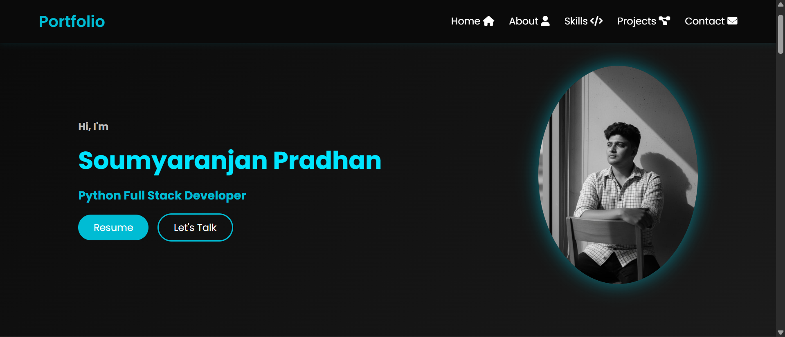

# 🌐 My Portfolio Website

Welcome to my personal portfolio website!  
This project showcases my skills, projects, and professional profile in a clean and responsive web interface.

---

## 🚀 About the Project

This portfolio website acts as my **personal digital presence**, where visitors can learn about:
- Who I am and what I do
- My technical skills
- Projects I have worked on
- Ways to contact me

The goal of this project is to present my work in a **simple, modern, and professional manner**.

---

## ✨ Features

- 📱 Fully responsive design (mobile & desktop)
- 🧑 About Me section
- 🛠️ Skills & technologies overview
- 📂 Projects showcase
- 📬 Contact section
- 🎨 Clean UI with modern styling

---

## 📸 Screenshots

> Screenshots will be added soon. This section will showcase the Home page, Projects section, and Contact section of the portfolio.



```

---

## 🛠️ Tech Stack

| Layer | Technology |
|------|------------|
| Frontend | HTML5, CSS3, JavaScript |
| Backend | Python, Django |
| Styling | Custom CSS |
| Deployment | GitHub / PythonAnywhere (optional) |

---

## 📁 Project Structure

```text
My_Portfolio_Website/
│── manage.py
│── db.sqlite3
│── requirements.txt
│
├── portfolio/
│   ├── templates/
│   ├── static/
│   ├── views.py
│   └── urls.py
│
└── myportfolio/
    ├── settings.py
    ├── urls.py
    └── wsgi.py
```

---

## ⚙️ Installation & Setup

### 1️⃣ Clone the Repository
```bash
git clone https://github.com/SoumyarananPradhan/My_Portfolio_Website.git
cd My_Portfolio_Website
```

### 2️⃣ Create Virtual Environment
```bash
python -m venv env
source env/bin/activate  # Linux / Mac
env\Scripts\activate     # Windows
```

### 3️⃣ Install Dependencies
```bash
pip install -r requirements.txt
```

### 4️⃣ Run Migrations
```bash
python manage.py migrate
```

### 5️⃣ Run Development Server
```bash
python manage.py runserver
```

Open browser and visit:  
👉 http://127.0.0.1:8000/

---

## ✅ Implemented Enhancements

All planned enhancements for this portfolio have been **successfully implemented**.

The current version includes:

- 🌙 Dark mode support
- 📄 Downloadable resume section
- ✉️ Contact section (ready for integration)
- 🌐 Deployment-ready structure

This project now represents a **complete and polished portfolio website**, not a work-in-progress.

---

## 🎯 Placement & Recruiter Notes

This portfolio project demonstrates:

- Practical **frontend fundamentals** (HTML, CSS, JavaScript)
- **Django project structuring** and template rendering
- Clean code organization and readability
- Ability to design and ship a **complete personal product**

This project is suitable for:
- Internship applications
- Entry-level / Fresher Python Full-Stack roles
- Academic and personal showcase

---

## 👨‍💻 Author

**Soumyaranjan Pradhan**  
MCA Student | Python Full‑Stack Developer

- GitHub: https://github.com/SoumyarananPradhan
- LinkedIn: (add your LinkedIn here)

---

## ⭐ Support

If you like this project, please consider giving it a ⭐ on GitHub.  
Feedback and suggestions are always welcome!

